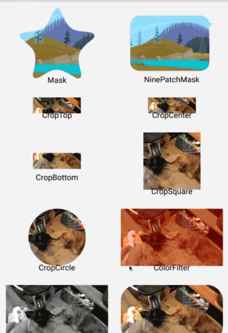

# 结合Picasso实现很炫的图片效果框架
开源项目地址:[https://github.com/open-android/Glide-transformations](https://github.com/open-android/Glide-transformations)
# 运行效果
  
  * 更多干货请下载app

## 使用步骤
### 1. 在project的build.gradle添加如下代码(如下图)

	allprojects {
	    repositories {
	        ...
	        maven { url "https://jitpack.io" }
	    }
	}
  
### 2. 在Module的build.gradle添加依赖

    compile 'com.github.open-android:Glide-transformations:0.1.0'
### 3. 使用Picasso加载图片时添加显示效果

	   Glide.with(context) 
        .load(url) 
	 .transform(new CropCircleTransformation())//图片最终会展示出圆形区域
        .into(view);
	Glide-transformations 是通过Glide加载图片中通过上面的transform可以设置图片展示的效果  CropCircleTransformation是圆形效果，还有很多其他的效果
	
	模糊效果
	Glide.with(this)
	.load(R.mipmap.ic_image_sample)
        .bitmapTransform(new BlurTransformation(this))
        .into(mResultIv);
	
	圆角效果
	Glide.with(this).load(R.mipmap.ic_image_sample)
        .bitmapTransform(new RoundedCornersTransformation(this, 24, 0, 
            RoundedCornersTransformation.CornerType.ALL))
        .into(mResultIv);
	
	遮盖效果
	Glide.with(this).load(R.mipmap.ic_image_sample)
        .bitmapTransform(new MaskTransformation(this, R.mipmap.ic_launcher))
        .into(mResultIv);
	
	灰度效果
	Glide.with(this).load(R.mipmap.ic_image_sample)
        .bitmapTransform(new GrayscaleTransformation(this))
        .into(mResultIv);

	其他效果
	ToonFilterTransformation
	SepiaFilterTransformation
	ContrastFilterTransformation
	InvertFilterTransformation
	PixelationFilterTransformation
	SketchFilterTransformation
	SwirlFilterTransformation
	BrightnessFilterTransformation
	KuwaharaFilterTransformation
	VignetteFilterTransformation
